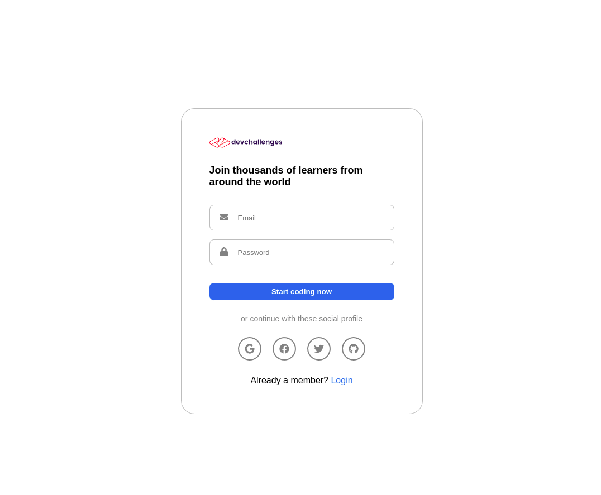
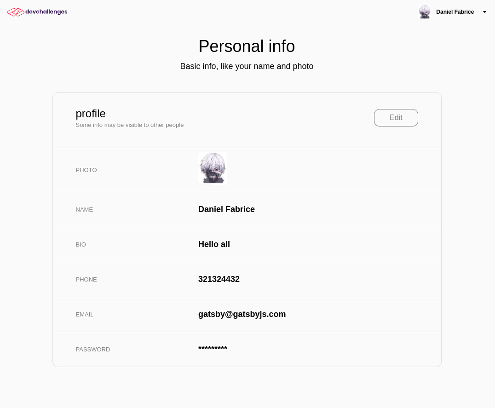

<h1 align="center">Authentication</h1>

<div align="center">
  <h3>
    <a href="https://authentication-ts.netlify.app/">
      Demo
    </a>
  </h3>
</div>

<!-- TABLE OF CONTENTS -->

## Table of Contents

<!-- - [Overview](#overview) -->

- [Built With](#built-with)
- [Features](#features)
- [How to use](#how-to-use)
- [Contact](#contact)
- [Acknowledgements](#acknowledgements)

<!-- OVERVIEW -->

## Overview





## [Acknowledgements](#acknowledgements)

An application that allow a user to register and login by using social network or email. This is build in order to practice Firebase.

### Built With

- [SASS](https://sass-lang.com/)
- [Firebase](https://firebase.google.com/?gclid=Cj0KCQjwhsmaBhCvARIsAIbEbH4vKTuET8xy7WJGdlNlt2piuk2_-YD2vVZUHY2mKg2XxNtKZ_vSEfAaAjIkEALw_wcB&gclsrc=aw.ds)
- [TypeScript](https://www.typescriptlang.org/)

## Features

- [Material design icon](https://google.github.io/material-design-icons/)

## How To Use

To clone and run this application, you'll need [Git](https://git-scm.com) and [Node.js](https://nodejs.org/en/download/) (which comes with [npm](http://npmjs.com)) installed on your computer. From your command line:

```bash
# Clone this repository
$ git clone https://github.com/voromahery/authentication-ts

# Install dependencies
$ npm install

# Run the app
$ npm start
```

## Contact

- Email: daniel.her@onja.org
- GitHub [voromahery](https://github.com/voromahery)
